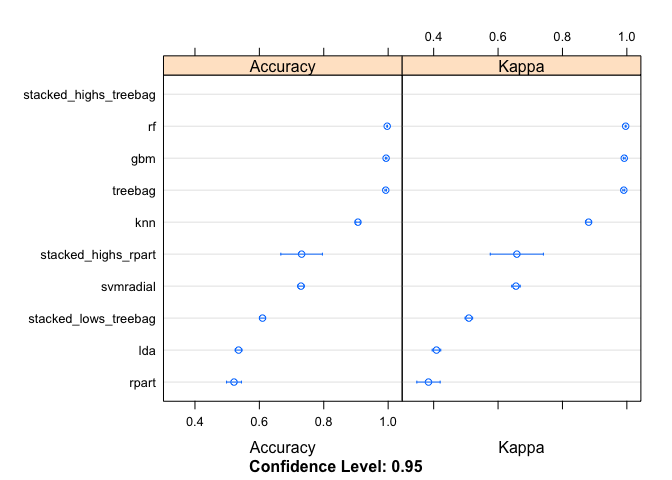

# Practical Machine Learning Course Project
Pouria Tabrizi  
06/26/2017  
  
## Executive Summary  
This report is using the data from accelerometers on the belt, forearm, arm, and dumbell of six participants, obtained from the two below links (for training and testing sets). With the ultimate goal of being able to build model/s to predict the 20 cases in the testing file to find out in what manner the participants performed the exercises ("A", "B", "C", "D", "E").
  
## Downloading and Reading Files  
Downloding and reading the training and testing files.  

```r
# training data set
download.file("https://d396qusza40orc.cloudfront.net/predmachlearn/pml-training.csv", destfile = "./training.csv", method = "curl")

# testing data set
download.file("https://d396qusza40orc.cloudfront.net/predmachlearn/pml-testing.csv", destfile = "./testing.csv", method = "curl")

# reading training data set
training = read.csv("./training.csv", stringsAsFactors = FALSE)
# reading testing data set
testing = read.csv("./testing.csv", stringsAsFactors = FALSE)
dim(training)
```

```
## [1] 19622   160
```

```r
dim(testing)
```

```
## [1]  20 160
```
  
## Tidy Data Set  
  
The first function (fun1), creates a data frame with three columns, showing the sum of three types of missing values - #DIV/0!, "", and NA -, respectively for each row. Through some exploratory data analysis, it is clear that, there are 100 columns that have 19216 or above missing values, this equals to 98% and above for some of these columns. The percentage of missing or empty values for these 100 columns is very high, thereby the conclusion is to completely exclude these columns from the models.  

```r
library(caret)
library(ggplot2)
sum(is.na(training))
```

```
## [1] 1287472
```

```r
fun1 <- function(a) {
    divValue <- as.character(); emptyValue <- as.character()
    naValue <- as.character(); combineValue <- data.frame()
    for(i in 1:dim(a)[2]) {
        divValue <- append(divValue, sum(a[, i] == "#DIV/0!"))
        emptyValue <- append(emptyValue, sum(a[, i] == ""))
        naValue <- append(naValue, sum(is.na(a[, i]) > 0))
    }
    combineValue <- cbind("divvalue" = divValue, 
                  "emptyvalue" = emptyValue,
                  "navalue" = naValue)
    return(combineValue)
}
shunValues <- as.data.frame(fun1(training))
# Displaying the look and correlation of such columns
shunValues[70:76, ]
```

```
##    divvalue emptyvalue navalue
## 70       80      19216       0
## 71       11      19216       0
## 72       77      19216       0
## 73       80      19216       0
## 74       11      19216       0
## 75     <NA>       <NA>   19216
## 76     <NA>       <NA>   19216
```
  
The below function (fun2), will return the indices of all the columns with the above mentioned three missing values.  

```r
fun2 <- function(a) {
    nacol <- as.character()
    for(i in 1:dim(a)[2]) {
        if(sum(is.na(a[, i])) > 0 || sum(a[, i] == "") > 0 
           || sum(a[, i] == "#DIV/0!") > 0) {
            nacol <- append(nacol, names(a[i]))
        }
    }
    b <- which(names(training) %in% nacol)
    return(b)
}
naCols <- fun2(training)
```
  
## Feature Variable Selection  

Creating outcome and predictors vectors to be used for building models. outcome contains the name of the variable "classe" and predictors contains the names for the remaining variables.  

```r
outcome <- 'classe'
temp <- names(training[-naCols])
tempPredictors <- temp[-c(1:6,60)]
```
  
There are still plenty of variables (53) to work with, thus the goal is to use Recursive Partitioning and Regression Trees (rpart) method, alongside cross validation (trainControl() function) to decrease the number of variables before building the models. The top variables count comes out to 14.  

```r
library(rpart)
set.seed(678)
featureControl <- trainControl("cv", number = 10)
featureSelection <- train(training[, tempPredictors], training[, outcome], method = "rpart", trControl = featureControl)
featureImportance <- varImp(featureSelection)
plot(featureImportance, top = 16)
```

<!-- -->

```r
# Saving the top variables to the predictors vector
predictors <- rownames(featureImportance$importance)[order(featureImportance$importance[,1], decreasing = TRUE)[1:14]]
```
  
## Data Partition
In this step, the training data is being divided to two seperate data sets for training and testing purposes, with conservation of the same 14 featured variables and the outcome variable of "classe".

```r
inTrain <- createDataPartition(y = training$classe, p = 0.7, list = FALSE)
parted_training <- training[inTrain, c(predictors,outcome)]
parted_testing <- training[-inTrain, c(predictors,outcome)]
dim(parted_training)
```

```
## [1] 13737    15
```

```r
dim(parted_testing)
```

```
## [1] 5885   15
```
  
## Cross Validation  
By scaling down from the total of 160 variables to 14, and dividing the main training data set to two data sets of parted_training and parted_testing, now it would be an ideal time to build the models. Before, building the models, this report would perform cross validation by defining trainControl(), with 10-fold cross validation.  

```r
set.seed(123)
train_control <- trainControl(method = "cv", number = 10, savePredictions = 'final', classProbs = TRUE)
```
  
## Model Building  
At this stage, there are going to be ten trained models and the goal is to locate the top Accuracy percentage models, after resampling them. The top Accuracy percentage models are, ensemble_stacked_highs_treebag, fitrf, fittreebag, fitgbm, and fitknn, respectively (looking at summary and dotplot of resampled2). The selected model is rffit with Mean Accuracy of 0.9971.  

```r
# 1.Linear Discriminant Analysis Model - Classification
set.seed(1234)
fitlda <- train(parted_training[, predictors], parted_training[, outcome], method = "lda", trControl = train_control)

# 2.Recursive Partitioning and Regression Trees Model - Classification, Regression
set.seed(1234)
fitrpart <- train(parted_training[, predictors], parted_training[, outcome], method = "rpart", trControl = train_control)

# 3.k-Nearest Neighbours Model - Classification, Regression
set.seed(1234)
fitknn <- train(parted_training[, predictors], parted_training[, outcome], method = "knn", trControl = train_control)

# 4.Stochastic Gradient Boosting Model - Classification, Regression
# long buffering is expected
set.seed(1234)
fitgbm <- train(parted_training[, predictors], parted_training[, outcome], method = "gbm", trControl = train_control, verbose = FALSE)

# 5.Random Forest Model - Classification, Regression
# longer buffering is expected
set.seed(1234)
fitrf <- train(parted_training[, predictors], parted_training[, outcome], method = "rf", trControl = train_control, ntree = 500)

# 6.treebag Model - Classification, Regression
set.seed(1234)
fittreebag <- train(parted_training[, predictors], parted_training[, outcome], method = "treebag", trControl = train_control)

# 7.Support Vector Machines with Radial Basis Function Kernel Model - Classification, Regression
# much longer buffering is expected
set.seed(1234)
fitsvmradial <- train(parted_training[, predictors], parted_training[, outcome], method = "svmRadial", trControl = train_control)

# Resampling the models
set.seed(1234)
resampled <- resamples(list(lda = fitlda, rpart = fitrpart, knn = fitknn, gbm = fitgbm, rf = fitrf, treebag = fittreebag, svmradial = fitsvmradial))
summary(resampled)
```

```
## 
## Call:
## summary.resamples(object = resampled)
## 
## Models: lda, rpart, knn, gbm, rf, treebag, svmradial 
## Number of resamples: 10 
## 
## Accuracy 
##             Min. 1st Qu. Median   Mean 3rd Qu.   Max. NA's
## lda       0.5098  0.5266 0.5373 0.5354  0.5422 0.5641    0
## rpart     0.4647  0.4983 0.5288 0.5212  0.5491 0.5582    0
## knn       0.8901  0.9043 0.9075 0.9062  0.9104 0.9213    0
## gbm       0.9884  0.9920 0.9934 0.9937  0.9956 0.9978    0
## rf        0.9949  0.9964 0.9967 0.9971  0.9985 0.9985    0
## treebag   0.9854  0.9914 0.9931 0.9925  0.9947 0.9956    0
## svmradial 0.7076  0.7215 0.7264 0.7292  0.7414 0.7505    0
## 
## Kappa 
##             Min. 1st Qu. Median   Mean 3rd Qu.   Max. NA's
## lda       0.3765  0.3980 0.4099 0.4087  0.4179 0.4455    0
## rpart     0.2982  0.3444 0.4009 0.3839  0.4292 0.4344    0
## knn       0.8608  0.8790 0.8830 0.8812  0.8866 0.9004    0
## gbm       0.9853  0.9899 0.9917 0.9920  0.9945 0.9972    0
## rf        0.9936  0.9954 0.9959 0.9963  0.9982 0.9982    0
## treebag   0.9816  0.9892 0.9913 0.9905  0.9933 0.9945    0
## svmradial 0.6281  0.6456 0.6518 0.6556  0.6712 0.6831    0
```

By running the modelCor() fucntion from the caret package, the goal is to find the lowest correlation between the already built models in the previous stage. The correlation is at its lowest between knn and rf Therefore, the base layer models for the stacking ensemble are fitknn and fitrf. 

```r
modelCor(resampled)
```

```
##                    lda       rpart          knn           gbm          rf
## lda        1.000000000  0.08843743  0.008051236  0.0514827886  0.11624223
## rpart      0.088437434  1.00000000  0.018532740 -0.5572096092  0.13780817
## knn        0.008051236  0.01853274  1.000000000  0.4753408058 -0.24039312
## gbm        0.051482789 -0.55720961  0.475340806  1.0000000000 -0.01435052
## rf         0.116242225  0.13780817 -0.240393124 -0.0143505168  1.00000000
## treebag    0.074046693  0.38224657  0.200177967 -0.0005957253  0.71355126
## svmradial -0.342056292  0.09777136  0.360271625  0.2784081440 -0.07519420
##                 treebag   svmradial
## lda        0.0740466930 -0.34205629
## rpart      0.3822465655  0.09777136
## knn        0.2001779672  0.36027162
## gbm       -0.0005957253  0.27840814
## rf         0.7135512595 -0.07519420
## treebag    1.0000000000  0.09003430
## svmradial  0.0900343028  1.00000000
```
  
Performing ensemble stacking methods using knn and rf as base loayers and treebag as the top layer, the highest mean accuracy of rf (0.9971) has been increased to 1 (100%).  Yet, as it will be illustrated in the upcoming steps, although the ensemble is with Accuracy of 1, yet when prediction is being applied to the parted_testing data set, the results for both models of rf and ensemble one is the same. Therefore, the selected model is still rf.  

```r
parted_training$pred_lda <- predict(fitlda, parted_training[, predictors])
parted_training$pred_rpart <- predict(fitrpart, parted_training[, predictors])
parted_training$pred_knn <- predict(fitknn, parted_training[, predictors])
parted_training$pred_rf <- predict(fitrf, parted_training[, predictors])

predictors_highs_models <- c('pred_knn', 'pred_rf')
predictors_lows_models <- c('pred_lda', 'pred_rpart')

# 8. Ensemble Stacked Model - treebag
set.seed(1234)
ensemble_stacked_highs_treebag <- train(parted_training[, predictors_highs_models], parted_training[, outcome], method = "treebag", trControl = train_control)

# 9. Ensemble Stacked Model - rpart
set.seed(1234)
ensemble_stacked_highs_rpart <- train(parted_training[, predictors_highs_models], parted_training[, outcome], method = "rpart", trControl = train_control)

# 10. Ensemble Stacked Model - treebag
set.seed(1234)
ensemble_stacked_lows_treebag <- train(parted_training[, predictors_lows_models], parted_training[, outcome], method = "treebag", trControl = train_control)

# Resampling all the models
set.seed(1234)
resampled2 <- resamples(list(lda = fitlda, rpart = fitrpart, knn = fitknn, gbm = fitgbm, rf = fitrf, treebag = fittreebag, svmradial = fitsvmradial, stacked_highs_treebag = ensemble_stacked_highs_treebag, stacked_highs_rpart = ensemble_stacked_highs_rpart, stacked_lows_treebag = ensemble_stacked_lows_treebag))
summary(resampled2)
```

```
## 
## Call:
## summary.resamples(object = resampled2)
## 
## Models: lda, rpart, knn, gbm, rf, treebag, svmradial, stacked_highs_treebag, stacked_highs_rpart, stacked_lows_treebag 
## Number of resamples: 10 
## 
## Accuracy 
##                         Min. 1st Qu. Median   Mean 3rd Qu.   Max. NA's
## lda                   0.5098  0.5266 0.5373 0.5354  0.5422 0.5641    0
## rpart                 0.4647  0.4983 0.5288 0.5212  0.5491 0.5582    0
## knn                   0.8901  0.9043 0.9075 0.9062  0.9104 0.9213    0
## gbm                   0.9884  0.9920 0.9934 0.9937  0.9956 0.9978    0
## rf                    0.9949  0.9964 0.9967 0.9971  0.9985 0.9985    0
## treebag               0.9854  0.9914 0.9931 0.9925  0.9947 0.9956    0
## svmradial             0.7076  0.7215 0.7264 0.7292  0.7414 0.7505    0
## stacked_highs_treebag 1.0000  1.0000 1.0000 1.0000  1.0000 1.0000    0
## stacked_highs_rpart   0.6611  0.6611 0.6617 0.7313  0.8361 0.8362    0
## stacked_lows_treebag  0.5834  0.6060 0.6086 0.6098  0.6157 0.6327    0
## 
## Kappa 
##                         Min. 1st Qu. Median   Mean 3rd Qu.   Max. NA's
## lda                   0.3765  0.3980 0.4099 0.4087  0.4179 0.4455    0
## rpart                 0.2982  0.3444 0.4009 0.3839  0.4292 0.4344    0
## knn                   0.8608  0.8790 0.8830 0.8812  0.8866 0.9004    0
## gbm                   0.9853  0.9899 0.9917 0.9920  0.9945 0.9972    0
## rf                    0.9936  0.9954 0.9959 0.9963  0.9982 0.9982    0
## treebag               0.9816  0.9892 0.9913 0.9905  0.9933 0.9945    0
## svmradial             0.6281  0.6456 0.6518 0.6556  0.6712 0.6831    0
## stacked_highs_treebag 1.0000  1.0000 1.0000 1.0000  1.0000 1.0000    0
## stacked_highs_rpart   0.5687  0.5689 0.5694 0.6584  0.7923 0.7924    0
## stacked_lows_treebag  0.4765  0.5046 0.5079 0.5093  0.5170 0.5379    0
```

```r
dotplot(resampled2)
```

<!-- -->
  
## Making Predictions for parted_testing Data Set
The selected model of ensemble_stacked_highs_treebag.  

```r
parted_testing$pred_knn <- predict(fitknn, parted_testing[, predictors])
parted_testing$pred_rf <- predict(fitrf, parted_testing[, predictors])
parted_testing$pred_stacked_treebag <- predict(ensemble_stacked_highs_treebag, parted_testing[, predictors_highs_models])


confusionMatrix(parted_testing$classe, parted_testing$pred_knn)$overall['Accuracy']
```

```
##  Accuracy 
## 0.9172472
```

```r
confusionMatrix(parted_testing$classe, parted_testing$pred_stacked_treebag)$overall['Accuracy']
```

```
##  Accuracy 
## 0.9979609
```

```r
confusionMatrix(parted_testing$pred_rf, parted_testing$pred_stacked_treebag)$overall['Accuracy']
```

```
## Accuracy 
##        1
```

```r
confusionMatrix(parted_testing$classe, parted_testing$pred_rf)$overall['Accuracy']
```

```
##  Accuracy 
## 0.9979609
```
  
## Expected Out of Sample Error
The expected out of sample error is lower for rf in comparison to knn.  

```r
sum(parted_testing$classe == parted_testing$pred_knn)
```

```
## [1] 5398
```

```r
table(parted_testing$classe, parted_testing$pred_rf)
```

```
##    
##        A    B    C    D    E
##   A 1674    0    0    0    0
##   B    6 1132    0    1    0
##   C    0    2 1024    0    0
##   D    0    0    0  964    0
##   E    0    0    0    3 1079
```

```r
sum(parted_testing$classe == parted_testing$pred_rf)
```

```
## [1] 5873
```

```r
# Alternative way of calculating the expected out of sample error:
1 - (sum(parted_testing$classe == parted_testing$pred_rf)/dim(parted_testing)[1])
```

```
## [1] 0.002039082
```
  
## Conclusion  
In conclusion, this report concluded to stay with the rf model as the final model (with the accuracy of 0.9963), although the ensemble stacked model using treebag had the accuracy of 1. The decision was based on when prediction was done on the parted_testing data set, and as the predictions' results were exactly the same for both rf and ensembled method. Below, the rf model is used on the original testing dataset and the 20 predections of the "classe" type were all correct.  

Using the rf model to predict the "classe" type, for the original testing data set.  

```r
testing$pred_rf <- predict(fitrf, testing[, predictors])
```
